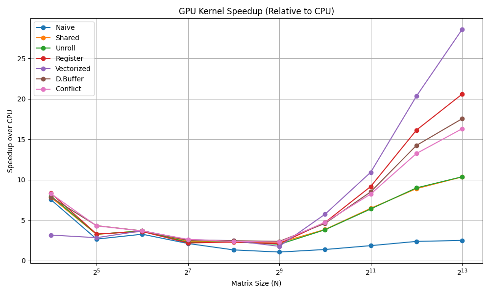

# CUDA Matrix Multiplication Benchmarking

This project benchmarks multiple GPU matrix multiplication kernels using CUDA. It helps evaluate different optimization techniques for matrix multiplication.

## Features

- Multiple CUDA kernel implementations:
  - Naive
  - Shared memory
  - Shared memory with loop unrolling
  - Register tiled
  - Vectorized register tiled
  - Double buffered
  - Bank conflict-free
- Time measurement using cudaEvent
- Optional CPU baseline
- CSV-formatted output for easy plotting

## Project Structure

The project follows a modular structure with separate folders for source files, compiled objects, headers, and binaries.

├── bin/ # Compiled executables\
├── include/ # Header files (.h or .hpp)\
│ ├── cpu_matmul.h # Optimized CPU matrix multiplication (OpenMP)\
│ ├── gpu_naive.h # Naive GPU implementation\
│ ├── gpu_shared.h # Shared memory-based GPU implementation\
│ ├── gpu_shared_unroll.h # Shared memory with loop unrolling\
│ ├── gpu_tiled.h # Tiled GPU implementation\
│ ├── gpu_tiled_unroll.h # Tiled + unrolled\
│ ├── gpu_bank.h # Bank conflict minimization\
│ ├── gpu_vector.h # Vectorized kernel\
│ ├── gpu_double_buffer.h # Double buffering implementation\
│ └── utils.cpp # Utility functions (timers, setup, etc.)\
├── obj/ # Compiled object files (.o)\
├── src/ # Source files (.cpp and .cu)\
│ ├── main.cpp # Entry point\
│ ├── cpu_matmul.cpp # Optimized CPU matrix multiplication (OpenMP)\
│ ├── gpu_naive.cu # Naive GPU implementation\
│ ├── gpu_shared.cu # Shared memory-based GPU implementation\
│ ├── gpu_shared_unroll.cu # Shared memory with loop unrolling\
│ ├── gpu_tiled.cu # Tiled GPU implementation\
│ ├── gpu_tiled_unroll.cu # Tiled + unrolled\
│ ├── gpu_bank.cu # Bank conflict minimization\
│ ├── gpu_vector.cu # Vectorized kernel\
│ ├── gpu_double_buffer.cu # Double buffering implementation\
│ └── utils.cpp # Utility functions (timers, setup, etc.)\
├── Makefile # Build system to compile all implementations\
└── README.md # Project documentation\

## Requirements

- NVIDIA CUDA-capable GPU
- CUDA Toolkit installed
- g++ or compatible C++ compiler

## Build

To compile the project:

    make

To clean build files:

    make clean

## Run

    ./bin/run

Set matrix size by modifying N in the source code. For benchmarking, loop through powers of two (e.g., 16, 32, ..., 4096).

## Benchmark Output

|   N   |  Naive   |  Shared  | Unroll  | Register | Vectorized | Double Buffer | Bank Conflict Free|
|-------|----------|----------|---------|----------|------------|----------|----------|
|  16   | 0.106899 | 0.098592 | 0.105837| 0.0907968| 0.0983936  | 0.103494 | 0.0928896|
|  32   | 0.0764096| 0.0837504| 0.0768896|0.0864832 | 0.077408   | 0.0812224| 0.0785792|
|  64   | 0.219174 | 0.0858816| 0.0856896|0.0903104 | 0.0836032  | 0.0838656| 0.0826624|
| 128   | 0.120122 | 0.110419 | 0.110989| 0.115635 | 0.107283   | 0.110234 | 0.109446 |
| 256   | 0.295354 | 0.200998 | 0.202579| 0.232314 | 0.190035   | 0.190323 | 0.208282 |
| 512   | 1.31528  | 0.645805 | 0.641773| 0.636358 | 0.571475   | 0.588339 | 0.5      |

## 📊 Performance Comparison

We benchmarked multiple matrix multiplication implementations—both CPU and CUDA-based—across varying input sizes (N×N). The GPU implementations employed several optimization techniques, including shared memory, register usage, loop unrolling, and double buffering.

### 📝 Observations

- **Scalability**: As matrix size increases, the performance gap between CPU and GPU implementations widens drastically. For instance, at N=8192, the CPU takes ~5900 ms, while the best GPU implementation takes ~206 ms.

- **GPU Naive vs. Optimized**:  
  - The **naive GPU implementation** initially outperforms CPU for small matrices (e.g., N=16 to N=64).
  - However, **optimized kernels** using **register blocking**, **loop unrolling**, and **vectorization** significantly reduce execution time for larger matrices.

- **Best-performing kernels**:
  - For medium sizes (N=256 to N=1024), **shared memory** and **loop unrolling** contribute the most to performance.
  - For large sizes (N=2048 to N=8192), the **vectorized kernel** consistently delivers the fastest execution.

- **CPU with OpenMP**:
  - OpenMP optimization helps reduce runtime on the CPU, but still falls short—showing **10×–30× slower performance** compared to optimized GPU kernels as size grows.

- **Cache & Bank Conflicts**:
  - The **conflict-aware kernel** shows benefits for mid-to-large sizes (N=128 to N=2048), but eventually gets outperformed by register-based or vectorized strategies.

These results highlight the effectiveness of CUDA optimizations, especially for large-scale matrix operations, and underline the GPU’s role in high-performance numerical computing.

## Learning Outcomes

- CUDA memory hierarchies (global, shared, register)
- Loop unrolling and tiling
- Warp-level optimization
- Performance benchmarking techniques
